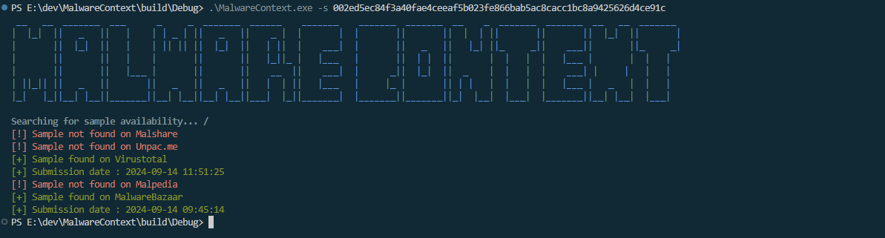
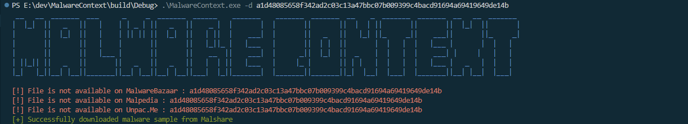

## About 
There are already plenty of malware analysis tools out there, but I’m adding one more to the mix—this time written in C. Inspired by [Malwoverview](https://github.com/alexandreborges/malwoverview), this tool is designed to make the early stages of malware analysis easier to handle.

The goals are:

1. Provide simple, digestible info for malware triage.
2. Allow querying APIs from different platforms.
3. Search for available malware samples.
3. Download malware through these APIs.
This tool is built to work with all your API keys plugged in, making the process straightforward and accessible for anyone looking to speed up their malware triage.

## Screenshots






## Current Version
Version 0.1.0:

```
This version:
- Added downloading functionality now to the 3rd party APIs (Malshare, Malwarebazaar, Malpedia, Unpac.Me).
  These are either zipped or thrown into a .bin file. The file will be saved in the current directory with the name of the hash. (SHA256.zip, SHA256.bin).
- Added a search function for the 3rd party APIs (Malshare, Malwarebazaar, Malpedia, Unpac.Me) (which is multi-threaded for some really stupid reason). Will more APIs to this one in the future.
- Experimented quite some with the APIs and figured them out, so the backend for handling is quite "okay" now. 
- Added a configuration file for the APIs. This is a JSON file and is located in the bin folder. Populate the APIs you will use.
- Added a help menu. (./malware_analysis -h)
- General backend cleanup. (I'm sure there's a lot of bad code in there.)
```

Version 0.1.0:
```
This version: 
- No stable way of using it; but it won't crash (ง •_•)ง Testing out how I want things to work.
```

## Installation
It's using cmake and vcpkg , so you do you (～￣▽￣)～ Still very, very early in development so it's barebones; which means we're on a "works on my PC" level.
The release version will built in the "bin" directory. 
```
mkdir build
cd build
cmake -G "Ninja" -DCMAKE_BUILD_TYPE=Release ..
cmake --build . 
```
Open the conf.json in the bin folder and populate the APIs you will use. 

```
{
    "apiKeys": {
      "virustotal": "",
      "malshare": "",
      "unpacme": "",
      "hybridanalysis": "",
      "malpedia": "",
      "malwarebazaar": "",
      "triage": ""
    }
}

```

## Contributors

Me, myself and I. 


